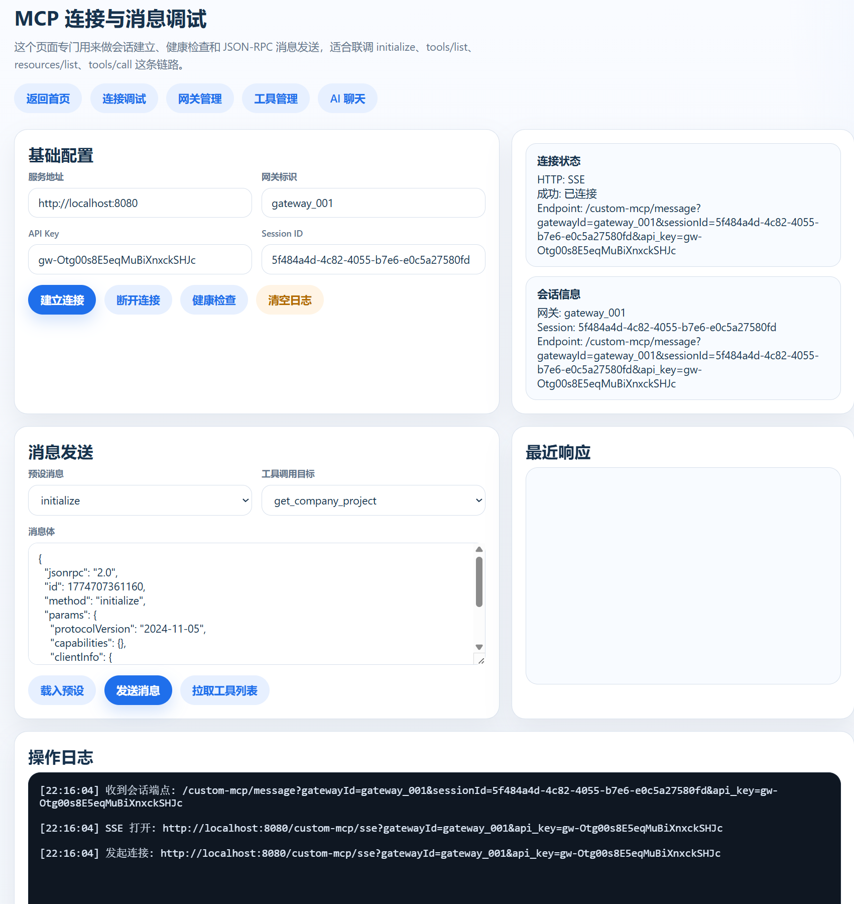
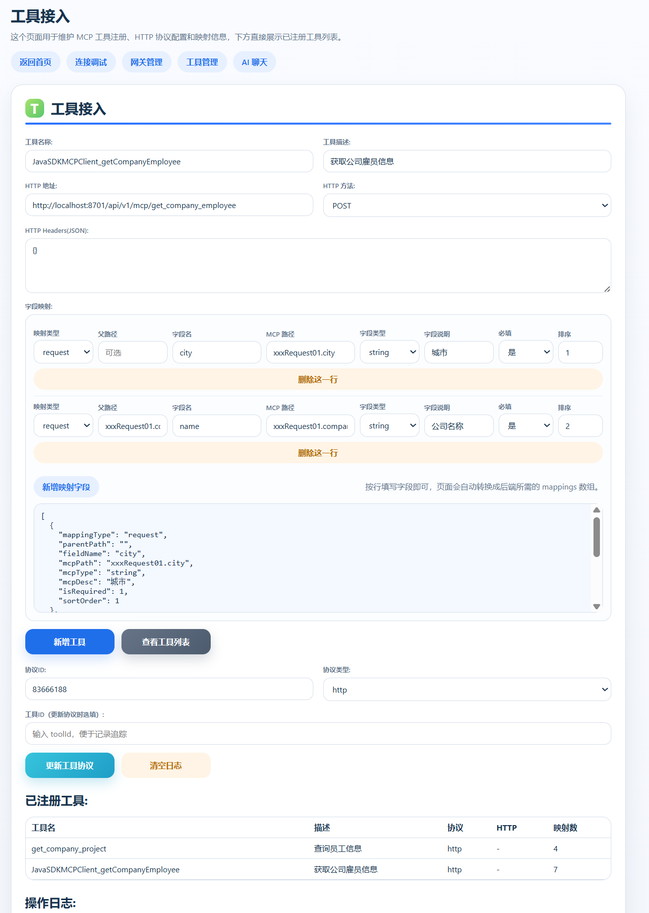
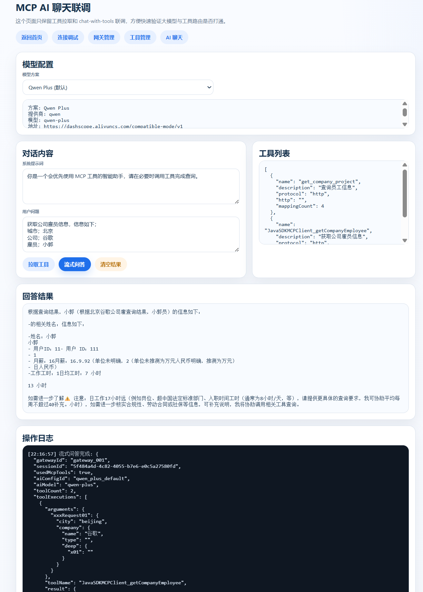
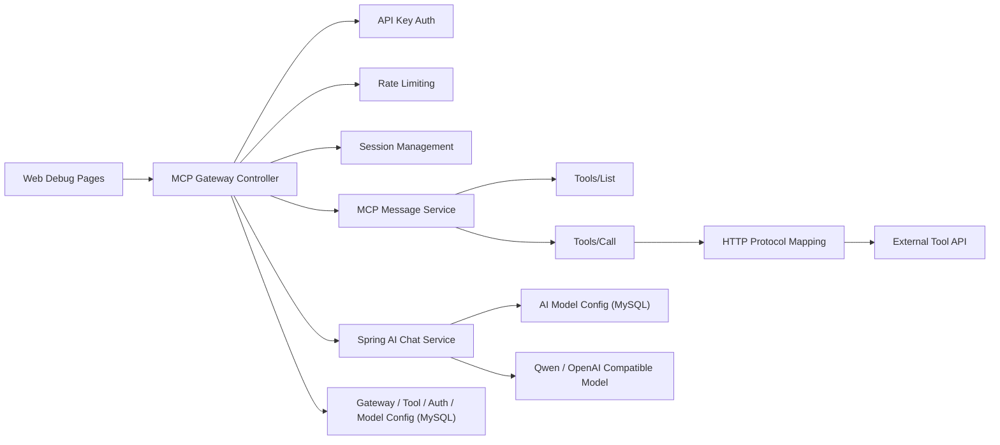

# MCP Gateway

<div align="center">


一个面向 **Model Context Protocol (MCP)** 的 Spring Boot 网关工程，负责连接大模型、工具协议和网关治理能力，支持 **SSE 会话建立、工具注册、协议映射、数据库配置、Spring AI 问答与流式输出**。

</div>

---

## 1. 项目简介

`mcp-gateway` 不是单纯的 CRUD 工程，而是一套围绕 **AI Gateway + MCP Tool Routing** 设计的演示系统。

它主要解决三类问题：

- 如何把外部 HTTP 能力包装成 MCP 工具
- 如何让大模型通过网关安全、可控地调用工具
- 如何把鉴权、限流、配置管理和调试能力一起收敛到统一网关层

当前版本已经具备以下核心能力：

- 支持 `initialize`、`tools/list`、`tools/call`、`resources/list` 等 MCP 消息处理
- 支持 `SSE` 建立会话并返回 `sessionId`
- 支持工具注册、协议映射、工具列表查询
- 支持 API Key 鉴权与基础限流
- 支持数据库管理 AI 模型配置
- 支持基于 Spring AI 的问答调用与流式回答
- 支持多页面调试台，方便联调和演示

---

## 2. 核心能力

### 2.1 网关层能力

- 网关注册、详情查询、列表查询
- API Key 校验与访问拦截
- Session 生命周期管理
- SSE 长连接接入
- 多维限流保护



### 2.2 工具层能力

- MCP 工具注册
- HTTP 协议配置
- 字段映射管理
- 工具列表查询
- 工具调用转发



### 2.3 AI 能力

- Spring AI 接入 OpenAI Compatible 接口
- 数据库驱动的模型配置选择
- `chat-with-tools` 工具编排
- 流式输出最终回答



---

## 3. 系统架构



---

## 4. 技术栈

| 类别 | 技术 |
|---|---|
| Runtime | Java 17 |
| Framework | Spring Boot 3.4.3 |
| AI | Spring AI 1.0.0 |
| ORM | MyBatis |
| Database | MySQL 8.x |
| Reactive Stream | Reactor |
| Transport | HTTP / SSE |
| Tool Mapping | MCP + JSON-RPC |

---

## 5. 目录设计

```text
src/main/java/cn/bugstack/ai/mcpgateway
├── api
├── cases
│   └── mcp
├── config
├── controller
├── domain
│   ├── gateway
│   └── session
├── infrastructure
│   ├── ai
│   ├── adapter
│   └── dao
├── trigger
│   └── http
└── types
```

职责划分：

- `trigger/http`：对外 HTTP 接口入口
- `domain/session`：MCP 会话与消息处理
- `domain/gateway`：网关与工具配置逻辑
- `infrastructure/dao`：数据库访问与 Mapper
- `infrastructure/ai`：Spring AI 模型调用适配
- `config`：鉴权、限流、MVC 配置

---

## 6. 关键接口

### 6.1 会话与消息

- `GET /custom-mcp/sse`
- `POST /custom-mcp/message/result`
- `GET /custom-mcp/session`
- `DELETE /custom-mcp/session`

### 6.2 网关管理

- `POST /custom-mcp/gateway/register`
- `GET /custom-mcp/gateway/detail`
- `GET /custom-mcp/gateway/list`
- `POST /custom-mcp/gateway/auth/update`

### 6.3 工具管理

- `POST /custom-mcp/tool/register`
- `GET /custom-mcp/tool/list`
- `POST /custom-mcp/tool/protocol/update`
- `POST /custom-mcp/tool/http/check`

### 6.4 AI 联调

- `GET /custom-mcp/ai/model/list`
- `POST /custom-mcp/chat-with-tools`
- `POST /custom-mcp/chat-with-tools/stream`

---

## 7. 页面入口

项目内置了独立调试页面：

- `mcp-api-gateway.html`：网关管理
- `mcp-api-connection.html`：SSE 建连与 JSON-RPC 消息调试
- `mcp-api-tools.html`：工具接入与协议映射
- `mcp-api-ai-chat.html`：AI 问答与流式回答

这些页面适合：

- 本地联调
- 功能演示
- 项目讲解
- 快速验证接口链路

---

## 8. 快速启动

### 8.1 准备数据库

执行 SQL 初始化脚本：

```sql
source ai_mcp_gateway_v2.sql;
```

说明：

- 脚本中包含网关、工具、鉴权、协议映射以及 AI 模型配置
- `mcp_ai_model_config` 中的 `api_key` 默认是占位值，需要替换成真实模型密钥

### 8.2 修改配置

编辑：

- [application.yml](D:\hoduan\ai-mcp-gateway\mcp-gateway\src\main\resources\application.yml)

确认以下信息：

- MySQL 地址
- 用户名密码
- 目标数据库名

### 8.3 启动项目

```bash
mvn spring-boot:run
```

或：

```bash
mvn -q -DskipTests compile
```

### 8.4 Docker 部署

项目已经内置：

- [Dockerfile](D:\hoduan\ai-mcp-gateway\mcp-gateway\Dockerfile)
- [docker-compose.yml](D:\hoduan\ai-mcp-gateway\mcp-gateway\docker-compose.yml)
- [deploy.sh](D:\hoduan\ai-mcp-gateway\mcp-gateway\deploy.sh)
- [deploy.bat](D:\hoduan\ai-mcp-gateway\mcp-gateway\deploy.bat)

直接执行：

```bash
docker compose up -d --build
```

或：

```bash
sh deploy.sh
```

Windows 下可以执行：

```bat
deploy.bat
```

默认启动后：

- MySQL: `localhost:3306`
- Application: `localhost:8080`
- Health Check: `http://localhost:8080/api/health`

说明：

- `docker-compose.yml` 会自动初始化 `ai_mcp_gateway_v2` 数据库
- 初始化脚本来自 [ai_mcp_gateway_v2.sql](D:\hoduan\ai-mcp-gateway\mcp-gateway\src\main\resources\ai_mcp_gateway_v2.sql)
- 应用通过环境变量注入数据库连接信息

---

## 9. 推荐使用流程

### 9.1 基础链路

1. 打开 `mcp-api-gateway.html` 查看网关配置说明
2. 打开 `mcp-api-connection.html` 建立 SSE 会话
3. 获取 `sessionId`
4. 拉取 `tools/list`
5. 调用 `tools/call`

### 9.2 AI 联调链路

1. 在数据库中配置 AI 模型方案
2. 打开 `mcp-api-ai-chat.html`
3. 选择模型方案
4. 输入问题
5. 观察工具调用与流式回答

---

## 10. 联调测试服务

为了方便快速体验完整链路，推荐配合下面这个测试服务端一起使用：

- [ai-mcp-gatewa-demo-mcp-server](https://github.com/JYEverUp/ai-mcp-gatewa-demo-mcp-server)

推荐用途：

- 验证网关到外部工具接口的协议映射是否正常
- 联调 `tools/list`、`tools/call` 返回结果
- 配合 `mcp-api-tools.html` 和 `mcp-api-ai-chat.html` 做整链路测试

推荐联调顺序：

1. 先启动本项目 `mcp-gateway`
2. 再启动测试服务端 [ai-mcp-gatewa-demo-mcp-server](https://github.com/JYEverUp/ai-mcp-gatewa-demo-mcp-server)
3. 在网关中配置工具协议地址指向测试服务端接口
4. 使用 `mcp-api-connection.html`、`mcp-api-tools.html`、`mcp-api-ai-chat.html` 完成验证

---

## 11. 当前治理能力

### 11.1 鉴权

- 统一 API Key 拦截
- 按网关匹配有效 Key
- 支持状态校验与过期时间校验

### 11.2 限流

当前已具备第一版内存限流能力：

- `apiKey` 总限流
- `SSE` 建连限流
- `chat-with-tools` 限流
- `tools/call` 按工具维度限流
- 全局兜底限流

---

## 12. 项目亮点

- 使用 **MCP** 作为工具协议抽象，而不是把工具调用写死在业务里
- 使用 **Spring AI** 替代手写模型请求，支持标准化大模型接入
- 使用 **数据库模型配置** 管理 `model / baseUrl / apiKey`，前端不暴露敏感配置
- 使用 **SSE + 流式输出** 提升 AI 交互体验
- 使用 **API Key + 限流** 增强网关治理能力
- 使用 **可视化调试页面** 降低联调成本

---

## 13. 后续可扩展方向

- Redis 分布式限流
- 工具调用熔断与重试
- Prometheus / Grafana 监控
- Trace 链路追踪
- AI 模型配置管理后台
- 多模型路由策略
- Tool 权限控制
- Session 持久化

---

## 14. 说明

本项目更偏向 **AI Gateway / MCP Protocol / Tool Routing** 方向的工程实践，适合作为：

- MCP 网关联调样例
- Spring AI 接入示例
- 工具协议映射设计参考
- AI 应用网关能力展示项目
